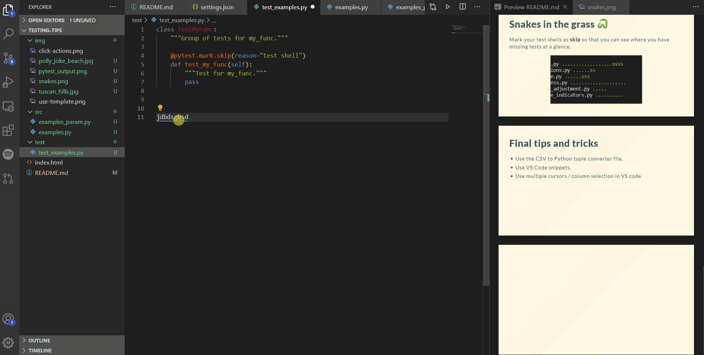

# How to write good tests quickly and efficiently


Mitch Edmunds

---

### Some of my favourite views

---

# Tuscan Hills, Italy


---

# Poly Joke Beach, Cornwall


---


---

## Intro and context

* Working on the Consumer Prices automation pipeline
* Most tests I write are asserting pandas/Spark DataFrame equality
* Mostly using functional paradigm, not OOP so much
* Examples will be given using pytest
<!--
pytest is the de facto standard test library
-->

---

> Always code as if the guy who ends up maintaining your code will be a violent psychopath who knows where you live.

&mdash; Martin Golding

<!--
Quite often that person will be you. I know what people are like at the ONS, they like to stay
here for 40 years or more.
-->

---

# Testing is a skill

How to get better:
* Read a book or some blog posts on the topic
  * [Getting Started With Testing in Python](https://realpython.com/python-testing/) - Real Python
  * [Python testing with pytest](https://www.oreilly.com/library/view/python-testing-with/9781680502848/) - Brian Okken
* Read the basics of the pytest documentation
* Read some tests in a Python library that you like
* Write tests!

<!--
Remember that there are people out there with the job title "Tester".
Learning how to test is not easy, so don't beat yourself up if you hit
a few stumbling blocks. It will take time - but it is a skill worth investing in.

What can you do to get better at testing?
* Read a book or some blog posts on the topic
* Read the basics of the pytest documentation
* Read some actual tests in a Python library that you like
* Write tests! Take the time to figure out what works and what doesn't.
  Write a test, get it to pass. Write another one - it's the only way
  to really get better.

-->

---

# Testing is time ~~consuming~~
# Testing is time WELL SPENT

<!--
What you should be expecting is to spend as much time testing, if not more, as you do programming.
Some of your initial reactions to that might be - well I just don't have time for that.
I know that because that's what I used to think when first confronted with the beast that is testing.
But now I understand how important testing is and I've experienced first hand how much easier my
life is further down the line if I have good tests in place. Now, I always make time for testing.

Time saved by not doing testing is a False Economy. You will spend much more time dealing with bugs
in the future than you spent writing the tests. And if not you, then someone else will have to clear
up your mess.
-->

---

# Testing makes you a better programmer

<!--
There's no doubt about it - my programming has improved massively since I started
writing tests as I go. Programming while holding the thought "How am I going to be
able to test this easily?" has meant that I arrive much quicker at a point where
I have functions representing single units of logic that can then, be easily tested.


I've seen it often across the ONS where someone will have some requirements, they'll
hack together a solution which works and then they'll submit it on Friday. There. Done.

What you've actually done in that scenario, is you've delivered the first draft... when
the publisher was expecting to go to print on Monday. You've got a beginning and an end
and some plot details, but you've taken a roundabout way to get there, you haven't
conveyed your meaning or intentions very well. There's lots that could have been cut,
changes you could have made to communicate things more clearly, and there's probably
some sub-plots and loose ends which weren't tied up.

The point I'm trying to make with that analogy is that it takes more than one draft to
get a piece of work to a stage where you should be happy to deliver it. It's true of a
report, it's true of an analysis and it's true of a computer program.

These are the things you're aiming for:
1. Accuracy
   - We all deal in numbers that have an impact on people's lives. Important decisions are made off the back of statistics that we publish. So it's paramount that the statistics we deliver are are as accurate as can possibly be. You have an opportunity to automate validation of published statistics if testing is done right. Use it.
2. Readable
   - Your code needs to be readable.
3. Maintainable
4. Extensible

-->

> Indeed, the ratio of time spent reading versus writing is well over 10 to 1. We are constantly reading old code as part of the effort to write new code. ...Therefore, making it easy to read makes it easier to write.

&mdash; Robert C. Martin, Clean Code: A Handbook of Agile Software Craftsmanship


---


<!-- _layout: two-columns -->

# What I'll be covering today

<!-- <style>
p { columns: 2; }
</style> -->

Will be covering

  - Test structure
  - What to test
  - Test data
  - Test parametrisation

Won't be covering

- How to use `pytest`
- Mocks / monkey-patching
-

<!--
Mix of community best practice and personal opinion - feel free to challenge.
-->

---


# Assert your authority

* The main component of any test is the `assert` statement.
* `pytest` uses the built-in `assert` for universal testing of native Python objects.
* Use `assert `:
  * to test for object equality
  * or whether some condition is True or False
* The output of `assert` provides a comprehensive diff if objects are equal.
* External libraries may provide their own assert functions e.g. `assert_frame_equal` in `pandas`


<!--
For unittest you need to memorise a number of assertion methods.
-->

---

# A few thoughts on test data

* Only use the minimum amount of test data needed to properly satisfy the test case.
    - Give example
* For generalised functions -> generalise the test data.
* Hard code your data where possible.
* If difficult - maybe the function is doing too much.


<!--
This may mean simplifying or stripping out the context of the original
problem that it was created to solve.
-->

---

# You're doing too much

* Remember, a function should do one thing and one thing only!

<style>
img[alt~="center"] {
  display: block;
  margin: 0 auto;
}
</style>

* Take with a pinch of salt.


* Consider writing a component test to cover the main expected behaviour of your program, then refactor a large function into multiple smaller units. Then test those units: voila! unit testing.

---

# How do you know what to test? (1)

* Positive testing: does the function have the expected output?
* Edge cases: write a test for each.
* Coverage: test for all relevant combinations of parameters.
* Negative testing: put yourself in the users' shoes
    - How might they break things?
    - What error message would you like to see if you did?

<!--
Contrive a simple example and calculate the expected output.

* Do this in your head, or in Excel. Get someone else to check it and make sure they arrive at the same.

Firstly, edge cases are about foresight. Have a sit down and think about all the different and strange scenarios that the function will have to handle. When working with a collection of number values this might be: what happens when some of the values are zero or NaN? What happens if all the values are zero or NaN?

TODO: “Never allow the same bug to bite you twice.” (Steve Maguire)

They're also about hindsight: you may come across a bug in your test or production environments. When you're writing a fix for those, make sure to write a test too so you can be sure you don't introduce the same bug again. Same with any lines of code that aim to pre-emptively deal with a bug.

If you want to develop your foresight: recommend some testing resources.

Is the parameter a switch? Then test when it is on and test when it is off.
Does the function work as expected when passed an argument with the data type it was expecting for that parameter. Does it work for other data types? Does it break in the expected way?

Coverage:
  If you have control-flow in your function such as an if/else statement, then you need to make sure that you test the code blocks for all available routes. Coverage is basically a % score for how many lines of your code are executed by the tests. 100% coverage should be the aim, but it's not the be all and end all. A suite of bad tests can still achieve 100% coverage.

What mistakes might a user make when using the function? How might they misuse it? Spending a little time thinking about this will help you write clearer code with a more usable API.
-->

---

# How do you know what to test? (2)

* Numbers:
  * Try positive numbers.
  * Try negative.
  * Try zeros.
  * Try NaNs.
* Data types:
  * Try the data types you expect.
  * Try the data types you don't expect - do they fail as expected?

---

<blockquote class="twitter-tweet"><p lang="en" dir="ltr">Devs watching QA test the product <a href="https://t.co/uuLTButB3x">pic.twitter.com/uuLTButB3x</a></p>&mdash; sanja zakovska 🌱 (@sanjazakovska) <a href="https://twitter.com/sanjazakovska/status/1352557733787152389?ref_src=twsrc%5Etfw">January 22, 2021</a></blockquote> <script async src="https://platform.twitter.com/widgets.js" charset="utf-8"></script>


---

<iframe width="560" height="315" src="https://www.youtube.com/embed/9akWR7Bl2Mw" frameborder="0" allow="accelerometer; autoplay; clipboard-write; encrypted-media; gyroscope; picture-in-picture" allowfullscreen></iframe>

<div class="youtube-player" data-id="https://www.youtube.com/watch?v=9akWR7Bl2Mw"></div>


---

# Dos and dont's

**Don't** over test


---

# Test shells :shell:

Write a test shell so you know to come back to it.

```python
class TestMyFunc:
    """Group of tests for my_func."""

    @pytest.mark.skip(reason="test shell")
    def test_my_func(self):
        """Test for my_func."""
        pass
```


---

# Snakes in the grass :snake:

Mark your test shells as **skip** so that you can see where you have missing tests at a glance.

<style>
img[alt~="center"] {
  display: block;
  margin: 0 auto;
}
</style>


---

# Final tips and tricks

* Use the CSV to Python tuple converter file.
* Use VS Code snippets.
* Use multiple cursors / column selection in VS code.

---



---

<script>
  /*
   * Light YouTube Embeds by @labnol
   * Credit: https://www.labnol.org/
   */

  function labnolIframe(div) {
    var iframe = document.createElement('iframe');
    iframe.setAttribute(
      'src',
      'https://www.youtube.com/embed/' + div.dataset.id + '?autoplay=1&rel=0'
    );
    iframe.setAttribute('frameborder', '0');
    iframe.setAttribute('allowfullscreen', '1');
    iframe.setAttribute(
      'allow',
      'accelerometer; autoplay; encrypted-media; gyroscope; picture-in-picture'
    );
    div.parentNode.replaceChild(iframe, div);
  }

  function initYouTubeVideos() {
    var playerElements = document.getElementsByClassName('youtube-player');
    for (var n = 0; n < playerElements.length; n++) {
      var videoId = playerElements[n].dataset.id;
      var div = document.createElement('div');
      div.setAttribute('data-id', videoId);
      var thumbNode = document.createElement('img');
      thumbNode.src = '//i.ytimg.com/vi/ID/hqdefault.jpg'.replace(
        'ID',
        videoId
      );
      div.appendChild(thumbNode);
      var playButton = document.createElement('div');
      playButton.setAttribute('class', 'play');
      div.appendChild(playButton);
      div.onclick = function () {
        labnolIframe(this);
      };
      playerElements[n].appendChild(div);
    }
  }

  document.addEventListener('DOMContentLoaded', initYouTubeVideos);
</script>
