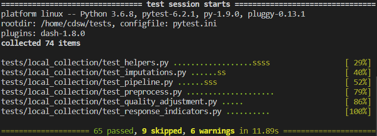

### How to write good tests quickly and efficiently

##### Mitch Edmunds

<head>
  <link rel="preconnect" href="https://fonts.gstatic.com">
  <link href="https://fonts.googleapis.com/css2?family=Montserrat:wght@500&display=swap" rel="stylesheet">
  <!-- <link rel="stylesheet" href="/path/to/styles/default.css">
  <script src="/path/to/highlight.min.js"></script>
  <script>hljs.initHighlightingOnLoad();</script> -->
</head>

<aside class="notes">
Who here:

* confident at testing?
* They're a pro at testing
* Hasn't really done any testing?

For those that haven't done any testing - what's been stopping you?
</aside>

---

### Some of my favourite views...

--


### Tuscan Hills, Italy

note:
Beautiful lush green hills
Recent bike packing trip

--


### Poly Joke Beach, Cornwall

note:
Near Crantock
3 day walking trip on the South West Coastal Path

--



### A passing test suite

---

### Testing is time ~~consuming~~
### Testing is time WELL SPENT

<!-- <div class="tenor-gif-embed" data-postid="10243842" data-share-method="host" data-width="50%" data-aspect-ratio="1.0"><a href="https://tenor.com/view/nobody-got-time-for-that-gif-10243842">Nobody Got Time For That AIntnobody Got Time For That GIF</a> from <a href="https://tenor.com/search/nobodygottimeforthat-gifs">Nobodygottimeforthat GIFs</a></div><script type="text/javascript" async src="https://tenor.com/embed.js"></script> -->

<aside class="notes">
You should be spending as much time testing, if not more, as you do programming.

Some of your initial reactions to that might be - well I just don't have time for that. I know that because that's what I used to think when first confronted with the beast that is testing.

But now through first hand experience, I've come to understand how important testing is. My life is so much easier down the line if I take the time to put some good tests in place. Now, I always make time for testing, and you should to.

Testing is important and you should be making that clear to the business area that you're working for. Make it clear to them that if time is not made for testing, then you are potentially compromising the quality of the statistics. Not only that, but you're going to get a whole heap of problems down the line if the requirements happen to change. Set their expectations and set them as early as possible. Then voila, you should then have time for testing.

If you are tempted to just carry on - you've built your feature, you've done some exploratory testing, you can see that it seems to be working for your inputs - let me just make it clear once again that time saved by not doing testing is a False Economy. You will spend much more time dealing with bugs in the future than you spent writing the tests. And if not you, then someone else will have to clear up your mess.

</aside>

--

> Always code as if the guy who ends up maintaining your code will be a violent psychopath who knows where you live.

&mdash; Martin Golding

<aside class="notes">
Quite often that person will be you. During the short time I was in Prices, 2 people retired after more than 40 years. It will come back to haunt you.
</aside>

---

### Testing is a skill

--

* Read a book or some blog posts on the topic
  * [Getting Started With Testing in Python](https://realpython.com/python-testing/) - Real Python
  * [Python testing with pytest](https://www.oreilly.com/library/view/python-testing-with/9781680502848/) - Brian Okken
* Read the [basics of the pytest documentation](https://docs.pytest.org/en/stable/getting-started.html)
* Read some tests in a Python library that you like
* **Write tests!**


<aside class="notes">
Remember that there are people out there with the job title "Tester".
And learning how to test is not easy, so don't beat yourself up if you hit a few stumbling blocks. It will take time - but it is a skill worth investing in.


What can you do to get better at testing?

The number one most important thing to get better at testing, is to Write some tests!
Take the time to figure out what works and what doesn't. Write a test, get it to pass. Write another one - it's the only way to really get better.
</aside>

---

### Testing will make you a better programmer

<aside class="notes">
There's no doubt about it - my programming has massively improved since I started writing tests regularly. If I program while holding the thought "How am I going to be able to test this easily?" it means that I arrive much quicker at unit functions that are: easy to test. What is a unit function:

* should do one thing and one thing only
* clear and concise

Testing and programming should be a constant cycle. If you had to write a book or a report, you wouldn't hand in your first draft. The same should be true with code. Write some code, write some tests. Improve your code, improve your tests and so on. Tests are a tool for you to self edit your code.
</aside>

---

### Testing is documentation

> Readability counts.

&mdash; [PEP 20, The Zen of Python](https://www.python.org/dev/peps/pep-0020/)

<aside class="notes">
A good test script should be a joy to look at.

It should take the reader through a clear cut example of how a function or class is supposed to be used, and often, how it's not supposed to be used, without having the need to run it themselves. For me, I want to see what's going in, what's being executed, and what's coming out. Anything else is a distraction. If you have complex setup procedures, abstract as much as you can out of the test script so that you're left only with the bare essentials for understanding what your functions are doing.

I've highlighted there one line from the Zen of Python, "Readability Counts". I think it's as true for test scripts as it is for your source files.

While of course utility is the most important attribute of your test suite, (your tests should be well designed, have good coverage and should pass as a minimum), taking some care to layout your tests in a way that is easy to read and understand will elevate your test scripts into a key part of your program's documentation.

Additionally, I want to see any data inputs or outputs in a way that is easy for my human brain to comprehend, preferably without scrolling - I'll come onto a few tips later on to help with this.
</aside>

--

> Indeed, the ratio of time spent reading versus writing is well over 10 to 1. We are constantly reading old code as part of the effort to write new code. ...Therefore, making it easy to read makes it easier to write.

&mdash; Robert C. Martin, Clean Code: A Handbook of Agile Software Craftsmanship

<aside class="notes">
I just wanted to finish up this part with a quote - you spend much more time reading old code as you do writing new code. And to reiterate, you should treat your tests as a living piece of documentation for your code - because that's what they are. Write them with the expectation that they'll be read months and years down the line - because they probably will be. Think about the structure. Think about keeping your test data as close as possible to your test. Think about all the things that will make things easier for the reader to see what is going on.
</aside>

---

# Basics

---

### Structure

* Your tests should live in a directory at the top level of the project
* Tests are grouped into modules in the test directory
* The test directory should be a *mirror* of your source directory
* Tests can be further grouped using test classes

note:
Not necessary to group into classes.

---

### Naming

* Test modules should start with *test_*
* So should your test functions
* Name should be descriptive enough so you know what the test is
* Don't worry if your test function names are long
* Make it nice for pytest output

--

#### Function naming

* Long and descriptive
* Include function name


--

#### Class and function naming

* No need to repeat the function name in the test functions
* Comes through from the class name


--

#### Parametrised test naming

###### Avoid repetition

Bad example


Good example


<aside class="notes">
I'll come onto test parametrisation a bit later, but put simply, it's just running the same test a number of times with a different set of parameters - which might be your inputs and outputs.
</aside>

---

### Assert your authority

* The main component of any test is the `assert` statement
  * Tests whether some condition is True or False
<!-- * The output of `assert` provides a comprehensive diff if objects are equal. -->
* `pytest` uses the built-in `assert` for universal testing of native Python objects
* External libraries may provide their own assert functions e.g.
  * `assert_frame_equal` in `pandas`
  * `assert_approx_df_equality` in `chispa` (for Spark)


note:
For unittest you need to memorise a number of assertion methods.

---

### A basic test

```python
def to_snake_case(words: Sequence[str]) -> str:
    return '_'.join(words)

def test_to_snake_case():
    test_input = ['talk', 'to', 'the', 'hand']
    result = to_snake_case(test_input)
    assert result == 'talk_to_the_hand'
```

###### Function {.fragment .current-only data-code-focus=1-2}

###### Test function {.fragment .current-only data-code-focus=4-7}

###### Input {.fragment .current-only data-code-focus=5}

###### Test result {.fragment .current-only data-code-focus=6}

###### Assert test result equals expected result {.fragment .current-only data-code-focus=7}

---

### How do you know what to test? (1)

###### Positive testing
###### Edge cases
###### Coverage
###### Negative testing

--

### Positive Testing
###### Does the function have the expected output?

<aside class="notes">
Contrive a simple example and calculate the expected output.

Do this in your head, or in Excel. Get someone else to check it and make sure they arrive at the same.
</aside>

--

### Edge Cases
###### "An uncommon or odd occurrence."

<aside class="notes">
Firstly, edge cases are about foresight. Have a sit down and think about all the different and strange scenarios that the function will have to handle. When working with a collection of number values this might be: what happens when some of the values are zero or NaN? What happens if all the values are zero or NaN?

Practicing writing test and catching bugs is the best way to develop your foresight.
</aside>

--

> “Never allow the same bug to bite you twice.”

<p style="text-align:center;">&mdash; Steve Maguire</p>

<aside class="notes">
They're also about hindsight: you may come across a bug in your test or production environments. When you're writing a fix for those, make sure to write a test too so you can be sure you don't introduce the same bug again. Same with any lines of code that aim to pre-emptively deal with a bug.

One last thing on edge cases, if you are passing a pandas dataframe in as an input that contains several different edge cases in the data, if the test fails you won't know which edge case is breaking the data. Split each edge case out into it's own test.
</aside>

--

### Coverage
###### Test for all relevant combinations of parameters

<aside class="notes">
Coverage:
  If you have control-flow in your function such as an if/else statement, then you need to make sure that you test the code blocks for all available routes. Coverage is basically a % score for how many lines of your code are executed by the tests. Once you're familiar with testing: 100% coverage should be the aim. But it's not the be all and end all. A suite of bad tests can still achieve 100% coverage.

Is the parameter a switch? Then test when it is on and test when it is off.
</aside>

--

### Negative testing
###### Put yourself in the users' shoes

<aside class="notes">
- How might they break things?
- What mistakes might be made when using the function?
- What error message would you like to see?
- How might they misuse it?

Spending a little time thinking about this will help you write clearer code with a more usable API.
</aside>

--

<div>
  <blockquote class="twitter-tweet"><p lang="en" dir="ltr">Devs watching QA test the product <a href="https://t.co/uuLTButB3x">pic.twitter.com/uuLTButB3x</a></p>&mdash; sanja zakovska 🌱 (@sanjazakovska) <a href="https://twitter.com/sanjazakovska/status/1352557733787152389?ref_src=twsrc%5Etfw">January 22, 2021</a></blockquote> <script async src="https://platform.twitter.com/widgets.js" charset="utf-8"></script>
</div>

---

### How do you know what to test? (2)

Numbers &mdash; try:
  * Positives
  * Negatives
  * Zeros
  * NaNs

Data types &mdash; try:
  * Types you expect
  * Types you don't expect - do they fail as expected?

---

### Priorities

* Test the most complex or vulnerable parts of your code first
* Focus on realistic use cases first

---

### Test data

* Only use the minimum amount of test data needed to properly satisfy the test case.
* If it's a dataframe, only include columns you need.
* For generalised functions, generalise the test data.
* Hard code your data where possible.
* Keep the test data close to the test.
* If difficult - maybe the function is doing too much.

<aside class="notes">
This may mean simplifying or stripping out the context of the original problem that it was created to solve.

Where I generally make exceptions for hardcoding data are, if the data I want to test is too long so that I have to scroll to see the entire dataset in my editor. At that point you're losing the readability benefits of have the test data in the script. This only typically occurs when I'm doing component testing, as the inputs generally need to be more complex.

If the data is small enough, and there is minimal extra setup - then just include the test data in the test body as that's the closest you can get.
</aside>

--

#### How to layout your data

```python
@pytest.fixture
def input_df_pandas():
    """Return simple pandas input df for index method tests."""
    return create_dataframe([
        ('prices', 'base_prices', 'quantity', 'base_quantity'),
        (2.46,  2.46, 17.0, 16.6),
        (7.32,  7.2,  5.3,  5.4),
        (1.13,  1.1,  2.1,  2.1),
        (12.39, 11.2, 12.9, 13.3),
        (6.63,  6.8,  7.2,  7.4),
    ])
```

<aside class="notes">
create_dataframe is a function in my conftest which calls the pandas DataFrame constructor but uses the first row as the column headers.

It's just a simple thing but makes a big difference for readability.

Some people like to align their data into neat columns here but that's a matter of preference.
</aside>

--

#### Data sources

* Unit tests - your own head
* Component tests - get the business area to help
* Mocking - use a fake data generator ([Faker](https://faker.readthedocs.io/en/master/index.html))

---

### Using fixtures

```python
@pytest.fixture
def my_fixture():
    return value
```

<aside class="notes">
You may have noticed that the data in the previous slide was marked as a fixture.

Fixtures are a form of dependency injection.

They are special functions that are collected by the pytest runner, and they typically contain some data or object that is then injected into the test at the time that test is executed.

When should you use a fixture? Typically if you have something you want to re-use several times.
</aside>

--

### `conftest.py`

* Sits in the top level of your tests directory
  * (but can sit at any level)
* Contains fixtures you want to share throughout your whole test suite

--

### Fixture scope
###### Particularly useful for resource intensive setup

```python
@pytest.fixture(scope="session")
def spark_session():
    """Set up spark session fixture."""
    print('Setting up test spark session')

    os.environ['PYSPARK_PYTHON'] = '/usr/local/bin/python3'

    suppress_py4j_logging()

    return (
        SparkSession
        .builder
        .master("local[2]")
        .appName("cprices_test_context")
        .config("spark.sql.shuffle.partitions", 1)
        # .config("spark.jars", jar_path)
        # This stops progress bars appearing in the console whilst running
        .config('spark.ui.showConsoleProgress', 'false')
        .getOrCreate()
    )
```

--

### Fixture functions

* Define using a closure or inner function

```python
@pytest.fixture
def to_spark(spark_session):
    """Convert pandas df to spark."""
    def _(df: pd.DataFrame):
        return spark_session.createDataFrame(df)
    return _
```

* Use `input_df_pandas` from before

```python
@pytest.fixture
def input_df(to_spark, input_df_pandas):
    """Return simple spark input df for index method tests."""
    return to_spark(input_df_pandas)
```

<aside class="notes">
This is necessary because of the inherent nature of fixtures.

I find this useful as it means when I'm writing test data, the to_spark function is available to me whenever I need it. Because it's a fixture that lives in my conftest, I don't even need to import it.

I tend to construct PySpark test data from pandas data, because it's more familiar, and there's no need to define the schema.
</aside>

---

### Common pitfalls

* Grouping tests by class but forgetting to add ``self`` to parameters
* Forgetting to declare something as a fixture
* Doing too much - cut your functions down.

<aside class="notes">
Remember, a function should do one thing and one thing only!

Consider writing a component test to cover the main expected behaviour of your program, then refactor a large function into multiple smaller units. Then test those units: voila! unit testing.
</aside>

---

### Rules that you can break

###### Max line length
###### Docstring conventions
###### Not being DRY

<aside class="notes">
Rules are meant to be broken right?

Use your judgement.

Don't worry about writing DRY code in test scripts, at least when starting out.
</aside>

---

### Test shells 🐚

###### Write a test shell so you know to come back to it

```python
class TestMyFunc:
    """Group of tests for my_func."""

    @pytest.mark.skip(reason="test shell")
    def test_my_func(self):
        """Test for my_func."""
        pass
```

---

### Snakes in the grass 🐍

Mark your test shells as **skip** so that you can see where you have missing tests at a glance.


---

### Parametrising Tests
###### Running the same test for multiple sets of inputs and outputs

--

### Simple case

```python
@pytest.mark.parametrize(
  'digits,expected',
  [(3, 5.786) (1, 5.8), (0, 6), (8, 5.78646523)]
)
def test_round(digits, expected):
    assert round(5.78646523, digits) == expected
```

###### Using built in pytest.mark.parametrize

##### Not very pretty or readable {.fragment .current-only data-code-focus=1-4}

--

### More complicated cases

###### Named test cases
###### Parametrising fixtures
###### Mixing fixtures with other types
###### Variable number of parameters

Check out [mitches-got-glitches/testing-tips](https://github.com/mitches-got-glitches/testing-tips) for more info and examples.

--

##### Example

```python
@parametrize_cases(
    Case(
        label="carli_fixed_base",
        index_method='carli',
        base_price_method='fixed_base',
        expout='large_output_carli_fixed_base.csv',
    ),
    Case(
        label="dutot_fixed_base",
        index_method='dutot',
        base_price_method='fixed_base',
        expout='large_output_dutot_fixed_base.csv',
    ),
    Case(
        label="jevons_fixed_base",
        index_method='jevons',
        base_price_method='fixed_base',
        expout='large_output_jevons_fixed_base.csv',
    ),
    Case(
        label="laspeyres_fixed_base",
        index_method='laspeyres',
        base_price_method='fixed_base',
        expout='large_output_laspeyres_fixed_base.csv',
    ),
    Case(
        label="paasche_fixed_base",
        index_method='paasche',
        base_price_method='fixed_base',
        expout='large_output_paasche_fixed_base.csv',
    ),
    Case(
        label="fisher_fixed_base",
        index_method='fisher',
        base_price_method='fixed_base',
        expout='large_output_fisher_fixed_base.csv',
    ),
    Case(
        label="tornqvist_fixed_base",
        index_method='tornqvist',
        base_price_method='fixed_base',
        expout='large_output_tornqvist_fixed_base.csv',
    ),
    Case(
        label="carli_chained",
        index_method='carli',
        base_price_method='chained',
        expout='large_output_carli_chained.csv',
    ),
    Case(
        label="dutot_chained",
        index_method='dutot',
        base_price_method='chained',
        expout='large_output_dutot_chained.csv',
    ),
    Case(
        label="jevons_chained",
        index_method='jevons',
        base_price_method='chained',
        expout='large_output_jevons_chained.csv',
    ),
    Case(
        label="jevons_bilateral",
        index_method='jevons',
        base_price_method='bilateral',
        expout='large_output_jevons_bilateral.csv',
    ),
    Case(
        label="laspeyres_bilateral",
        index_method='laspeyres',
        base_price_method='bilateral',
        expout='large_output_laspeyres_bilateral.csv',
    ),
    Case(
        label="paasche_bilateral",
        index_method='paasche',
        base_price_method='bilateral',
        expout='large_output_paasche_bilateral.csv',
    ),
    Case(
        label="fisher_bilateral",
        index_method='fisher',
        base_price_method='bilateral',
        expout='large_output_fisher_bilateral.csv',
    ),
    Case(
        label="tornqvist_bilateral",
        index_method='tornqvist',
        base_price_method='bilateral',
        expout='large_output_tornqvist_bilateral.csv',
    ),
    Case(
        label="jevons_fixed_base_with_rebase",
        index_method='jevons',
        base_price_method='fixed_base_with_rebase',
        expout='large_output_jevons_rebased_unchained.csv',
    ),
    Case(
        label="tornqvist_fixed_base_with_rebase",
        index_method='tornqvist',
        base_price_method='fixed_base_with_rebase',
        expout='large_output_tornqvist_rebased_unchained.csv',
    ),
)
def test_index_scenarios(
    input_data_large,
    index_method,
    base_price_method,
    expout,
    filename_to_pandas,
):
    """Test for all different combinations of index method."""
    expected_output = filename_to_pandas(expout)

    actual_output = calculate_index(
        input_data_large,
        date_col='month',
        levels=['group', 'id'],
        base_price_method=base_price_method,
        index_method=index_method,
    )

    assert_frame_equal(actual_output.reset_index(), expected_output)
```

---

# Final tips and tricks

* Use the CSV to Python tuple converter file
* Use VS Code snippets
* Use VS code keyboard shortcuts
* Bash bindings
* Use VS code!!

note:
You have to be on DevTest.
Dave has written a good guide.

---

### VS Code
##### Keyboard Shortcuts

--

###### Copy lines - SHIFT + ALT + Up/Down Arrow


--

###### Select every occurrence


--

###### Replace all within selection
###### CTRL + H then ALT + L


--

###### Multiple cursors - ALT + click


--

###### Multiple cursors - keyboard edition
###### CTRL + ALT + up/down arrow


--

###### Column box selection - ALT + SHIFT + drag mouse


---

### VS Code
##### Snippets

--

###### Test shell


--

###### Parametrising fixtures


---

### Bash bindings

Add these to your `.bashrc`

```bash
bind '"\e[A": history-search-backward'
bind '"\e[B": history-search-forward'
bind '"\eOA": history-search-backward'
bind '"\eOB": history-search-forward'
```


---

### Questions

<iframe width="560" height="315" src="https://www.youtube.com/embed/9akWR7Bl2Mw" frameborder="0" allow="accelerometer; autoplay; clipboard-write; encrypted-media; gyroscope; picture-in-picture" allowfullscreen></iframe>

note:
Questions

---

### Additional resources


[Quality Assurance of Code for Analysis and Research](https://best-practice-and-impact.github.io/qa-of-code-guidance/testing_code.html)

&mdash; Best Practice and Impact team

<aside class="notes">
If you're interested in what I used to create this presentation, it's reveal.js framework. I used it in combination with a VS code extension which enables you to build presentations from markdown.
</aside>